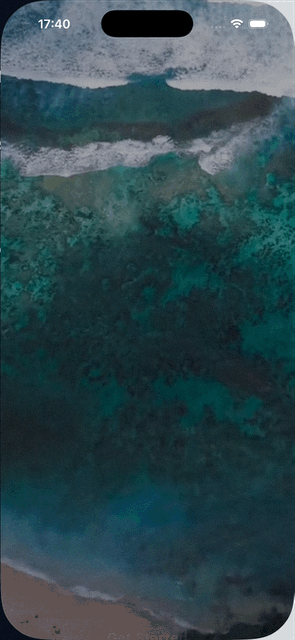

# React Native Animation Sandbox (Expo & Reanimated)

Este projeto é um repositório sandbox criado com **Expo** contendo protótipos de animações e interações premium de alto desempenho, utilizando **React Native Reanimated**, Expo Video, Expo Sensors (DeviceMotion) e outras ferramentas avançadas.

---

## 📱 Protótipos Inclusos

### 1. Anchor (Sea)
Uma experiência cinematográfica inspirada em interfaces náuticas e submarinas, com vídeo de fundo parallax, sensores de movimento físicos e uma transição fluida de expansão de portal para um dashboard de dados em vidro (glassmorphism).



#### 🚀 Funcionalidades da Animação:
- **Parallax por Sensor de Movimento:** Utiliza o giroscópio do dispositivo (`DeviceMotion`) para rotacionar/inclinar de forma sutil o fundo de vídeo, a vinheta e as camadas de texto de interface (UI) independentemente, criando uma sensação real de profundidade 3D.
- **Transição de Portal:** Ao tocar em "Get Started", o botão se expande exponencialmente (escala até 25x), engolindo a tela inteira com uma cor escura enquanto a UI de introdução desaparece suavemente, abrindo espaço para a tela principal de forma dinâmica.
- **Efeito Shimmer no Botão:** Uma animação contínua de reflexo luminoso corre ao longo do botão de vidro usando um gradiente linear animado por *worklets* da thread de UI.
- **Entrada de Letras Animada (Staggered Logo):** As letras de "ANCHOR" entram uma a uma com transições de opacidade e translação vertical baseadas em seus índices individuais.
- **Feedback Háptico:** Integração com a API `expo-haptics` para emitir uma confirmação física instantânea de sucesso quando o portal se abre.
- **Glassmorphism no Dashboard:** Tela principal estruturada com cartões de efeito de vidro translúcido, métricas oceanográficas animadas e transições de entrada dinâmicas baseadas em mola (`FadeInDown`).

#### 📁 Arquivos Importantes:
- [src/app/(sea)/sea.tsx](./src/app/(sea)/sea.tsx)
- [src/app/(sea)/home.tsx](./src/app/(sea)/home.tsx)

---

### 2. Apple Invites
Uma recriação fluida e de alta performance da animação de carrossel de convites inspirada na Apple, utilizando as bibliotecas `@animatereactnative/marquee`, `@animatereactnative/stagger` e **React Native Reanimated**.


#### 🚀 Funcionalidades da Animação:
- **Carrossel Infinito Horizontal (Marquee):** Um loop infinito e contínuo controlado por gestos e valores animados compartilhados.
- **Efeito de Rotação Tridimensional Dinâmica:** As imagens inclinam-se de forma inteligente (de `-3deg` a `3deg`) dependendo de sua posição na tela (com base em interpolação no thread de UI).
- **Fundo Desfocado Dinâmico (Blurred Background):** O fundo do aplicativo altera suavemente a imagem desfocada (com desfoque de `50` pixels) sincronizando com a imagem que está centralizada na tela no momento.
- **Entrada em Cascata (Stagger):** Textos informativos inferiores entram em cena com uma animação elegante em cascata com atrasos incrementais.

#### 📁 Arquivos Importantes:
- [src/app/(apple)/appleInvites.tsx](./src/app/(apple)/appleInvites.tsx)

---

## 🛠️ Tecnologias Principais

- **Framework:** [Expo](https://expo.dev) (v57.0.0+)
- **Motor de Renderização:** [React Native](https://reactnative.dev) (v0.86.0)
- **Biblioteca de Animação:** [React Native Reanimated](https://docs.swmansion.com/react-native-reanimated/) (v4.5.0)
- **Vídeo Nativo:** `expo-video`
- **Giroscópio e Sensores:** `expo-sensors` (`DeviceMotion`)
- **Feedback Tátil:** `expo-haptics`
- **Marquee Component:** `@animatereactnative/marquee`
- **Stagger Component:** `@animatereactnative/stagger`
- **Worklets:** `react-native-worklets`

---

## 📁 Estrutura de Código Importante

A navegação e a seleção dos protótipos de animação estão localizadas na tela principal:
- [src/app/index.tsx](./src/app/index.tsx)

---

## 🏁 Como Rodar o Projeto

### 1. Instalar as dependências

Recomendado utilizar o **Bun** ou o gerenciador de pacotes de sua preferência:

```bash
bun install
# ou
npm install
```

### 2. Iniciar o Servidor Expo

```bash
bun run start
# ou
npm start
```

Pressione:
- `a` para abrir no emulador Android
- `i` para abrir no simulador iOS
