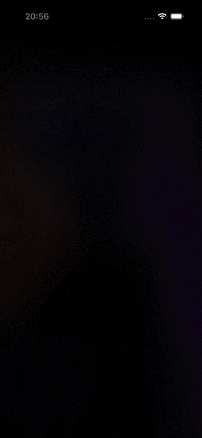

# Apple Invites Animation (Expo & Reanimated)


Este projeto é um aplicativo mobile criado com **Expo** que demonstra uma recriação fluida e de alta performance da animação de carrossel de convites inspirada na Apple, utilizando as bibliotecas `@animatereactnative/marquee`, `@animatereactnative/stagger` e **React Native Reanimated**.

---

## 🚀 Funcionalidades

- **Carrossel Infinito Horizontal (Marquee):** Um loop infinito e contínuo controlado por gestos e valores animados compartilhados.
- **Efeito de Rotação Tridimensional Dinâmica:** As imagens inclinam-se de forma inteligente (de `-3deg` a `3deg`) dependendo de sua posição na tela (com base em interpolação no thread de UI).
- **Fundo Desfocado Dinâmico (Blurred Background):** O fundo do aplicativo altera suavemente a imagem desfocada (com desfoque de `50` pixels) sincronizando com a imagem que está centralizada na tela no momento.
- **Entrada em Cascata (Stagger):** Textos informativos inferiores entram em cena com uma animação elegante em cascata com atrasos incrementais.

---

## 🛠️ Tecnologias Principais

- **Framework:** [Expo](https://expo.dev) (v57.0.0+)
- **Motor de Renderização:** [React Native](https://reactnative.dev) (v0.86.0)
- **Biblioteca de Animação:** [React Native Reanimated](https://docs.swmansion.com/react-native-reanimated/) (v4.5.0)
- **Marquee component:** `@animatereactnative/marquee`
- **Stagger component:** `@animatereactnative/stagger`
- **Worklets:** `react-native-worklets`

---

## 📁 Estrutura de Código Importante

O arquivo principal da lógica de animação está localizado em:
- [src/app/AppleInvites.tsx](./src/app/AppleInvites.tsx)

### Detalhes de Animação Implementados:

1. **Módulo Seguro em Worklet (`safeModulo`):** 
   Utiliza a fórmula `((val % mod) + mod) % mod` rodando diretamente na thread do dispositivo (UI thread) para garantir que o carrossel nunca falhe ou desapareça em posições negativas ao rolar para a esquerda.
   
2. **Interpolação de Rotação:**
   Cada item do carrossel calcula sua rotação com `interpolate()` mapeando seu deslocamento horizontal na tela:
   - Lateral Esquerda: `-3deg`
   - Centro: `0deg`
   - Lateral Direita: `3deg`

3. **Resolução de Conflitos de Layout:**
   Para evitar o alerta do Reanimated (`[Reanimated] Property "opacity" may be overwritten by a layout animation`), o projeto utiliza cores baseadas em canais alfa (`rgba(...)`) nas fontes de texto ao invés da propriedade `opacity` estática de CSS. Isso impede conflitos quando o componente `<Stagger>` aplica transições de exibição de layout nos mesmos elementos.

---

## 🏁 Como Rodar o Projeto

### 1. Instalar as dependências

Recomendado utilizar o **Bun** ou gerenciador de pacotes de sua preferência:

```bash
bun install
# ou
npm install
```

### 2. Iniciar o Servidor Expo

```bash
bun run start
# ou
npm start
```

Pressione:
- `a` para abrir no emulador Android
- `i` para abrir no simulador iOS
